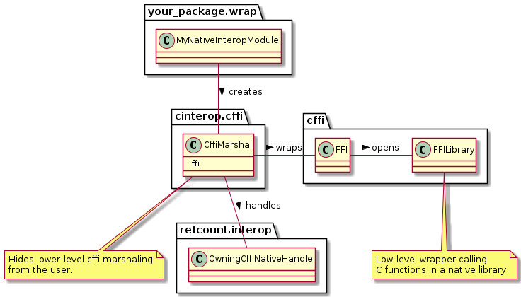

# cinterop - helpers for Python-C interop via CFFI

[](https://github.com/csiro-hydroinformatics/c-interop/blob/master/bindings/python/cinterop/LICENSE.txt)  [](https://cinterop.readthedocs.io/en/latest/?badge=latest) [](https://codecov.io/gh/csiro-hydroinformatics/c-interop) master: [](https://github.com/csiro-hydroinformatics/c-interop/actions/workflows/python-cinterop.yml) testing: [](https://github.com/csiro-hydroinformatics/c-interop/actions/workflows/python-cinterop.yml)



This package is primarily for managing and marshalling resources in native libraries, written for instance in C++, from Python. The package includes some generic helper facilities on top of CFFI for basic C types, and additional facilities for passing various types of data structures (C `struct`s). These are informed mostly by the domain of environmental modelling and simulation, but most are generic.

* date/time
* numeric or character vectors
* numeric or character dictionaries
* univariate or multivariate time series
* statistical definitions

## License

MIT (see [License.txt](https://github.com/csiro-hydroinformatics/c-interop/blob/master/bindings/python/cinterop/LICENSE.txt))

## Documentation

Hosted at [cinterop via readthedocs.io](https://cinterop.readthedocs.io/en/latest/?badge=latest)

## Source code

[Marshalling data between C, C++ and other programming languages onGitHub](https://github.com/csiro-hydroinformatics/c-interop)

## Installation

```sh
pip install cinterop
```

From source:

```sh
pip install -r requirements.txt
python setup.py install
```

## Sample use

Placeholder section

## Related work

Placeholder section

### Ancestry, acknowledgements

This python package `cinterop` relates loosely to prior work for interoperability between C++, R and .NET ([R.NET](https://github.com/rdotnet/rdotnet))

`cinterop` features using `cffi` were also significantly informed by Kevin Plastow's [work](https://search.informit.com.au/documentSummary;dn=823898220073899;res=IELENG) while he was at the Australian Bureau of Meteorology; this contribution is gratefully acknowledged.

In you have native interop needs you may also want to look at:

* the nuget package [dynamic-interop-dll](https://github.com/rdotnet/dynamic-interop-dll) for .NET/native interop.
* Reference counting package [refcount](https://github.com/csiro-hydroinformatics/pyrefcount)
* a C# library for [generating interop glue code on top of C API glue code](https://github.com/csiro-hydroinformatics/c-api-wrapper-generation).

### Other python packages

Placeholder
